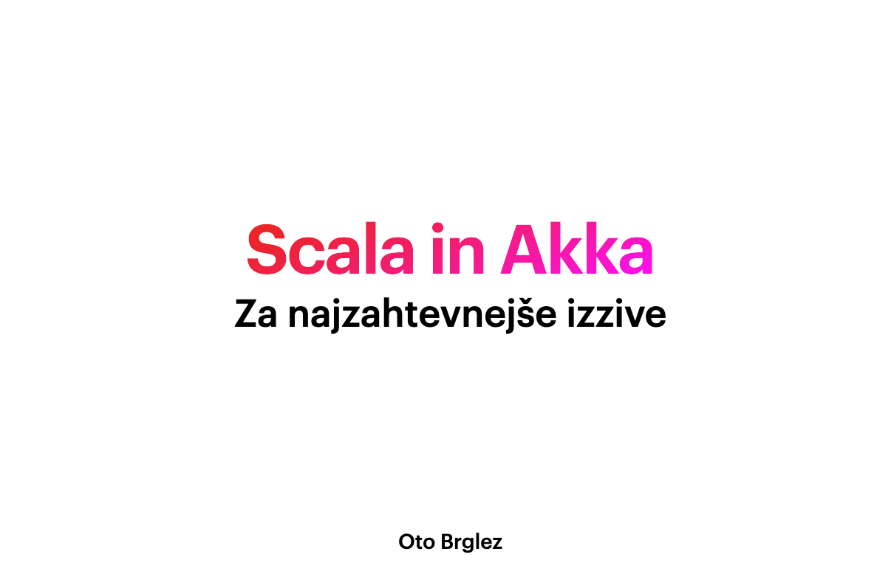

# Scala in Akka - Za najzahtevnejše izzive

Repozitorij vsebuje Keynote in [PDF predstaviteve](public/scala-in-akka_oto-brglez.pdf) ter vso kodo, ki je bila napisana v sklopu predavanja.

Predavanje je potekalo v sklopu Spletnih Uric Maribor 2020 / 21.

# Video

- [Facebook Video (Live Stream recording)](https://www.facebook.com/watch/live/?v=974815349714336&ref=watch_permalink)
- [YouTube Video (Live Stream recording](https://youtu.be/4TlEGJrwv7s?t=456)

# Avtor

- [Oto Brglez](https://github.com/otobrglez) / [@otobrglez](https://twitter.com/otobrglez)

